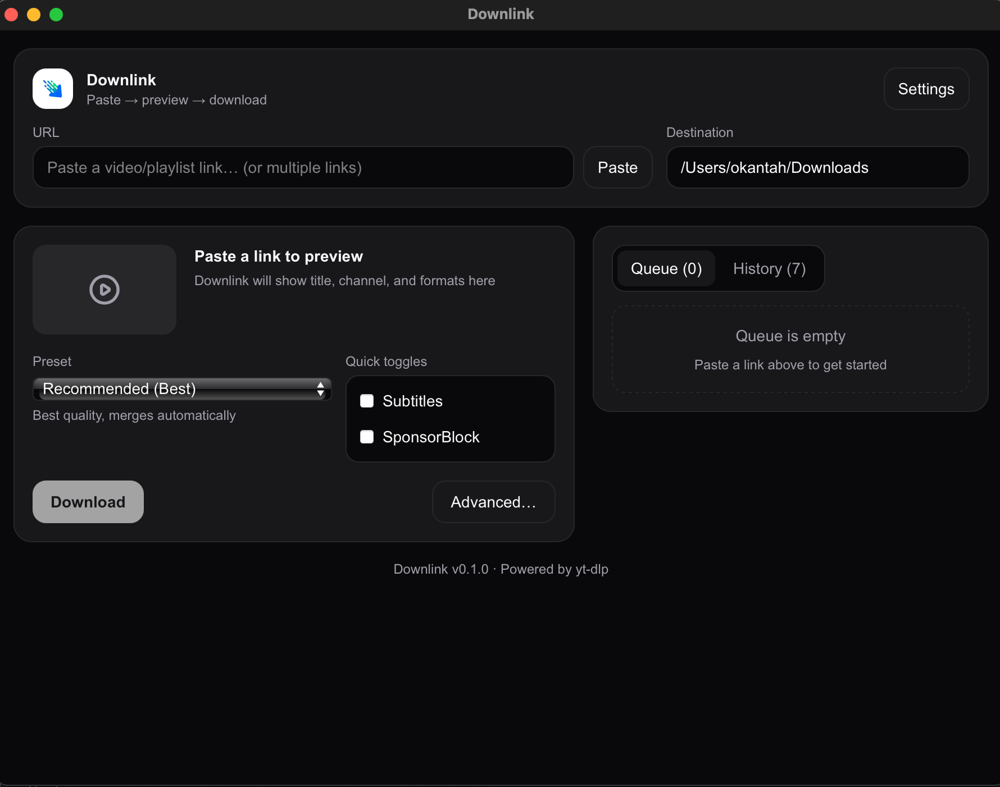

# Downlink

A lightweight, cross-platform desktop application for downloading online media using [yt-dlp](https://github.com/yt-dlp/yt-dlp) as the extraction/downloading engine.

[](https://provleon.github.io/downlink/)
[](LICENSE)

**[📥 Download Downlink](https://provleon.github.io/downlink/)** — Get the latest release for macOS, Windows, and Linux.



## Features

- **Paste → Preview → Download**: Simple, intuitive workflow
- **Multi-URL Support**: Paste multiple URLs at once for batch downloads
- **Playlist Expansion**: Automatically expands playlists into individual queue items
- **Format Presets**: Quick selection of common formats (Best, 1080p MP4, Audio M4A, etc.)
- **SponsorBlock Integration**: Remove sponsor segments from videos
- **Subtitle Support**: Download and embed subtitles in multiple languages
- **Queue Management**: Start, stop, resume, cancel, and retry downloads
- **Progress Tracking**: Real-time progress with speed and ETA
- **History**: Browse and re-download completed items
- **Cross-Platform**: Runs on macOS, Windows, and Linux

## Tech Stack

- **Frontend**: Next.js 16 + React 19 + TypeScript + Tailwind CSS
- **Backend**: Rust + Tauri 2
- **Database**: SQLite (via rusqlite)
- **Media Engine**: yt-dlp + ffmpeg (sidecar binaries)

## Requirements

- [Node.js](https://nodejs.org/) 18+
- [Rust](https://www.rust-lang.org/tools/install) 1.77+
- [yt-dlp](https://github.com/yt-dlp/yt-dlp#installation) (installed and in PATH)
- [ffmpeg](https://ffmpeg.org/download.html) (optional, for merging/remuxing)

## Development Setup

### 1. Clone the repository

```bash
git clone https://github.com/yourusername/downlink.git
cd downlink
```

### 2. Install dependencies

```bash
npm install
```

### 3. Run in development mode

```bash
npm run tauri dev
```

This will start both the Next.js dev server and the Tauri development window.

### 4. Build for production

The easiest way to build is using the provided build scripts, which automatically download yt-dlp and ffmpeg binaries:

```bash
# macOS/Linux
./scripts/build.sh

# Windows (PowerShell)
.\scripts\build.ps1
```

Built applications will be in `src-tauri/target/release/bundle/`.

## Building for Distribution

### Using Build Scripts (Recommended)

We provide build scripts that automatically download the required binaries (yt-dlp, ffmpeg) and build the app:

#### macOS / Linux

```bash
# Build for current platform
./scripts/build.sh

# Build for specific target
./scripts/build.sh --target macos-arm64    # Apple Silicon
./scripts/build.sh --target macos-x64      # Intel Mac
./scripts/build.sh --target macos-universal # Universal binary
./scripts/build.sh --target linux-x64      # Linux x64

# Only download binaries (don't build)
./scripts/build.sh --download-only

# Clean and rebuild
./scripts/build.sh --clean
```

#### Windows (PowerShell)

```powershell
# Build for Windows x64
.\scripts\build.ps1

# Only download binaries
.\scripts\build.ps1 -DownloadOnly

# Clean and rebuild
.\scripts\build.ps1 -Clean
```

### Manual Build

If you prefer to build manually:

#### macOS

**Prerequisites:**
- Xcode Command Line Tools: `xcode-select --install`
- Rust with macOS targets

**Download binaries first:**
```bash
mkdir -p src-tauri/binaries
cd src-tauri/binaries

# Download yt-dlp
curl -L -o yt-dlp-aarch64-apple-darwin "https://github.com/yt-dlp/yt-dlp/releases/latest/download/yt-dlp_macos"
cp yt-dlp-aarch64-apple-darwin yt-dlp-x86_64-apple-darwin
chmod +x yt-dlp-*

# Download ffmpeg
curl -L -o ffmpeg.zip "https://evermeet.cx/ffmpeg/getrelease/zip"
unzip ffmpeg.zip
mv ffmpeg ffmpeg-x86_64-apple-darwin
cp ffmpeg-x86_64-apple-darwin ffmpeg-aarch64-apple-darwin
chmod +x ffmpeg-*
rm ffmpeg.zip
```

**Build:**
```bash
npm run tauri:build
```

**Output files:**
- `src-tauri/target/release/bundle/macos/Downlink.app` - Application bundle
- `src-tauri/target/release/bundle/dmg/Downlink_0.1.0_*.dmg` - Disk image

#### Windows

**Prerequisites:**
- Visual Studio Build Tools with C++ workload
- Rust with Windows target
- WebView2 (usually pre-installed on Windows 10/11)

**Download binaries first (PowerShell):**
```powershell
New-Item -ItemType Directory -Path "src-tauri\binaries" -Force

# Download yt-dlp
Invoke-WebRequest -Uri "https://github.com/yt-dlp/yt-dlp/releases/latest/download/yt-dlp.exe" `
  -OutFile "src-tauri\binaries\yt-dlp-x86_64-pc-windows-msvc.exe"

# Download ffmpeg (from gyan.dev)
$TempDir = New-Item -ItemType Directory -Path "$env:TEMP\ffmpeg-dl" -Force
Invoke-WebRequest -Uri "https://www.gyan.dev/ffmpeg/builds/ffmpeg-release-essentials.zip" `
  -OutFile "$TempDir\ffmpeg.zip"
Expand-Archive -Path "$TempDir\ffmpeg.zip" -DestinationPath $TempDir -Force
$FFmpegExe = Get-ChildItem -Path $TempDir -Filter "ffmpeg.exe" -Recurse | Select-Object -First 1
Copy-Item -Path $FFmpegExe.FullName -Destination "src-tauri\binaries\ffmpeg-x86_64-pc-windows-msvc.exe"
Remove-Item -Path $TempDir -Recurse -Force
```

**Build:**
```powershell
npm run tauri:build
```

**Output files:**
- `src-tauri/target/release/bundle/nsis/Downlink_0.1.0_x64-setup.exe` - NSIS installer
- `src-tauri/target/release/bundle/msi/Downlink_0.1.0_x64_en-US.msi` - MSI installer

#### Linux

**Prerequisites:**
```bash
# Ubuntu/Debian
sudo apt install libwebkit2gtk-4.1-dev build-essential curl wget file \
  libssl-dev libgtk-3-dev librsvg2-dev

# Fedora
sudo dnf install webkit2gtk4.1-devel openssl-devel gtk3-devel librsvg2-devel
```

**Download binaries first:**
```bash
mkdir -p src-tauri/binaries
cd src-tauri/binaries

# Download yt-dlp
curl -L -o yt-dlp-x86_64-unknown-linux-gnu "https://github.com/yt-dlp/yt-dlp/releases/latest/download/yt-dlp_linux"
chmod +x yt-dlp-*

# Download ffmpeg
curl -L -o ffmpeg.tar.xz "https://johnvansickle.com/ffmpeg/releases/ffmpeg-release-amd64-static.tar.xz"
tar -xf ffmpeg.tar.xz
mv ffmpeg-*-static/ffmpeg ffmpeg-x86_64-unknown-linux-gnu
chmod +x ffmpeg-*
rm -rf ffmpeg.tar.xz ffmpeg-*-static
```

**Build:**
```bash
npm run tauri:build
```

**Output files:**
- `src-tauri/target/release/bundle/deb/downlink_0.1.0_amd64.deb` - Debian package
- `src-tauri/target/release/bundle/rpm/downlink-0.1.0-1.x86_64.rpm` - RPM package
- `src-tauri/target/release/bundle/appimage/downlink_0.1.0_amd64.AppImage` - AppImage

### CI/CD with GitHub Actions

The repository includes a GitHub Actions workflow (`.github/workflows/release.yml`) that automatically builds for all platforms when you push a version tag:

```bash
git tag v0.1.0
git push origin v0.1.0
```

This creates a draft release with binaries for:
- macOS (ARM64 and x64)
- Windows (x64)
- Linux (x64)

All builds include bundled yt-dlp and ffmpeg - users don't need to install them separately!

## Project Structure

```
downlink/
├── app/                    # Next.js app (frontend)
│   ├── components/         # React components
│   │   ├── QueueItem.tsx   # Queue item display
│   │   └── SettingsModal.tsx # Settings modal
│   ├── hooks/              # React hooks
│   │   └── useDownlink.ts  # Tauri backend communication
│   ├── types.ts            # TypeScript type definitions
│   ├── page.tsx            # Main page component
│   ├── layout.tsx          # App layout
│   └── globals.css         # Global styles
├── src-tauri/              # Tauri/Rust backend
│   ├── src/
│   │   ├── lib.rs          # Main app entry and Tauri commands
│   │   ├── db.rs           # SQLite database operations
│   │   ├── download_manager.rs # Download execution and queue management
│   │   ├── tool_manager.rs # yt-dlp/ffmpeg binary management
│   │   ├── settings.rs     # User settings persistence
│   │   ├── events.rs       # Backend → Frontend events
│   │   ├── models.rs       # Data models
│   │   ├── url_utils.rs    # URL parsing and validation
│   │   └── ytdlp.rs        # yt-dlp process orchestration
│   ├── Cargo.toml          # Rust dependencies
│   └── tauri.conf.json     # Tauri configuration
├── downlink_docs.md        # Detailed design document
├── package.json            # Node.js dependencies
└── README.md               # This file
```

## Configuration

Settings are stored in the app's data directory:
- **macOS**: `~/Library/Application Support/Downlink/`
- **Windows**: `%APPDATA%\Downlink\`
- **Linux**: `~/.local/share/downlink/`

### Default Presets

| Preset | Description |
|--------|-------------|
| Recommended (Best) | Best quality, merges video+audio automatically |
| 1080p MP4 | Best quality up to 1080p in MP4 container |
| Best MP4 | Best quality preferring MP4 format |
| Audio M4A | Audio only in M4A format (fastest) |
| Audio MP3 320 | Audio only in MP3 320kbps |

## Tauri Commands

The frontend communicates with the backend via Tauri commands:

| Command | Description |
|---------|-------------|
| `add_urls` | Add URLs to the download queue |
| `fetch_metadata` | Fetch video/playlist metadata |
| `expand_playlist` | Expand playlist into individual items |
| `start_download` | Start a specific download |
| `stop_download` | Stop (pause) a download |
| `cancel_download` | Cancel and remove a download |
| `retry_download` | Retry a failed download |
| `get_queue` | Get all active queue items |
| `get_history` | Get completed downloads |
| `get_settings` | Get user settings |
| `save_settings` | Save user settings |
| `get_toolchain_status` | Get yt-dlp/ffmpeg versions and status |

## Events

Backend → Frontend events for real-time updates:

| Event | Description |
|-------|-------------|
| `AppReady` | App initialized with tool versions |
| `DownloadStarted` | Download has started |
| `DownloadProgress` | Progress update with percent, speed, ETA |
| `DownloadCompleted` | Download finished successfully |
| `DownloadFailed` | Download failed with error and remediation actions |
| `PlaylistExpanded` | Playlist expanded into child items |

## Contributing

1. Fork the repository
2. Create a feature branch (`git checkout -b feature/amazing-feature`)
3. Commit your changes (`git commit -m 'Add amazing feature'`)
4. Push to the branch (`git push origin feature/amazing-feature`)
5. Open a Pull Request

## License

This project is licensed under the MIT License.

```
MIT License

Copyright (c) 2025 Downlink

Permission is hereby granted, free of charge, to any person obtaining a copy
of this software and associated documentation files (the "Software"), to deal
in the Software without restriction, including without limitation the rights
to use, copy, modify, merge, publish, distribute, sublicense, and/or sell
copies of the Software, and to permit persons to whom the Software is
furnished to do so, subject to the following conditions:

The above copyright notice and this permission notice shall be included in all
copies or substantial portions of the Software.

THE SOFTWARE IS PROVIDED "AS IS", WITHOUT WARRANTY OF ANY KIND, EXPRESS OR
IMPLIED, INCLUDING BUT NOT LIMITED TO THE WARRANTIES OF MERCHANTABILITY,
FITNESS FOR A PARTICULAR PURPOSE AND NONINFRINGEMENT. IN NO EVENT SHALL THE
AUTHORS OR COPYRIGHT HOLDERS BE LIABLE FOR ANY CLAIM, DAMAGES OR OTHER
LIABILITY, WHETHER IN AN ACTION OF CONTRACT, TORT OR OTHERWISE, ARISING FROM,
OUT OF OR IN CONNECTION WITH THE SOFTWARE OR THE USE OR OTHER DEALINGS IN THE
SOFTWARE.
```

See [LICENSE](LICENSE) for the full license file.

## Acknowledgments

- [yt-dlp](https://github.com/yt-dlp/yt-dlp) - The amazing media downloader
- [Tauri](https://tauri.app/) - Framework for building desktop apps
- [Next.js](https://nextjs.org/) - React framework
- [SponsorBlock](https://sponsor.ajay.app/) - Community-driven sponsor skipping

## Roadmap

### v1.0
- [x] Basic download functionality
- [x] Queue management
- [x] Playlist expansion
- [x] Settings persistence
- [x] SponsorBlock integration
- [x] Subtitle support

### v1.1
- [ ] Format matrix (advanced format selection)
- [ ] Batch rules (per-channel/site presets)
- [ ] Download scheduler
- [ ] Bandwidth graphs
- [ ] Cookie import wizard

### Future
- [ ] Auto-update for app and tools
- [ ] Plugin system for custom presets
- [ ] Cloud sync for settings
